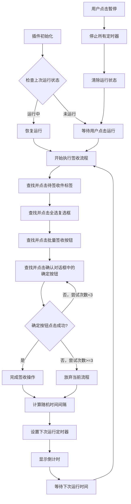

# 自动签收助手

这是一个浏览器插件，可以帮助用户自动点击页面上的"待签收件"按钮，实现自动签收功能。

## 功能

- 一键开启自动签收功能
- 可随时暂停操作
- 简洁直观的用户界面
- 自动循环执行签收流程
- 反检测机制，随机时间间隔执行

## 安装方法

1. 下载本插件的所有文件
2. 打开Chrome浏览器，进入扩展程序页面（chrome://extensions/）
3. 开启"开发者模式"
4. 点击"加载已解压的扩展程序"
5. 选择本插件的文件夹

## 使用方法

1. 点击浏览器工具栏中的插件图标
2. 在弹出窗口中点击"运行"按钮开始自动签收
3. 需要停止时点击"暂停"按钮

## 运行流程

1. **初始化**：
   - 插件启动时检查上次运行状态，如果之前处于运行状态，会自动恢复运行
   - 设置反检测参数，包括随机延迟、随机操作间隔等

2. **签收流程**：
   - 步骤1：查找并点击"待签收件"标签
   - 步骤2：查找并点击全选复选框
   - 步骤3：查找并点击"批量签收"按钮
   - 步骤4：查找并点击确认对话框中的"确定"按钮（最多尝试3次）
   - 步骤5：完成签收操作或放弃当前流程，安排下一次运行

3. **循环机制**：
   - 每次签收完成后，会随机安排下一次运行时间（默认18-22分钟）
   - 显示倒计时，实时更新下次运行时间
   - 到达设定时间后自动执行下一轮签收

4. **反检测措施**：
   - 操作之间添加随机延迟（800-2500毫秒）
   - 运行间隔随机化（18-22分钟）
   - 模拟真实鼠标移动和点击行为
   - 失败操作自动重试机制，最多尝试3次
   - 重试失败自动跳过当前流程，安排下一次运行

5. **状态管理**：
   - 实时更新并显示当前操作状态
   - 保存运行状态到浏览器存储，支持浏览器重启后恢复
   - 用户可随时通过插件弹窗查看当前状态

### 流程图

## 技术实现

1. **核心组件**：
   - `content.js`: 主要逻辑实现，包含自动签收流程和反检测机制
   - `popup.html/js`: 用户界面，提供控制按钮和状态显示
   - `manifest.json`: 插件配置文件

2. **关键技术**：
   - DOM元素查找和操作：使用多种策略查找页面元素
   - 事件模拟：模拟真实用户的鼠标移动和点击行为
   - 状态管理：使用Chrome Storage API保存运行状态
   - 消息通信：popup和content script之间通过Chrome消息API通信
   - 重试机制：关键操作失败时自动重试，最多3次

3. **反检测技术**：
   - 随机延迟：操作间添加不规则时间间隔
   - 人性化点击：模拟真实用户的点击行为，包括鼠标移动轨迹
   - 随机化运行间隔：避免固定时间模式被识别
   - 智能失败处理：当操作失败达到阈值时，自动放弃当前流程并安排下次运行

## 注意事项

- 本插件需要在包含"待签收件"按钮的页面上使用
- 使用前请确保您有权限进行签收操作
- 长时间运行可能会被系统检测为自动化操作，请适当调整使用频率
- 插件仅供学习和研究使用，请勿用于非法用途
